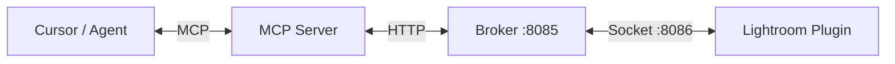

# Lightroom MCP

Bridge between [Adobe Lightroom Classic](https://www.adobe.com/products/photoshop-lightroom-classic.html) and AI agents via the [Model Context Protocol](https://modelcontextprotocol.io/) (MCP). Enables automated photo management, metadata editing, and catalog operations from Cursor and other MCP-capable clients.

## Architecture

- **Lightroom Plugin** (`lightroom-plugin.lrplugin/`) — Lua plugin running inside Lightroom Classic.
  - Connects to the Broker via Socket (port 8086) or HTTP polling.
- **MCP Broker** (`mcp-server/broker.py`) — A lightweight Flask server that acts as a bridge.
  - Relays requests between the Python MCP server and the Lua plugin.
  - Provides a dashboard at `http://localhost:8085`.
- **MCP Server** (`mcp-server/server.py`) — Python [FastMCP](https://github.com/jlowin/fastmcp) server.
  - Exposes Lightroom tools to Cursor/Claude.
  - Communicates with the Broker via HTTP.



## Prerequisites

- **Adobe Lightroom Classic** (LrSdk 10.0+)
- **Python 3.10+** (for the MCP server and Broker)
- **Lightroom** running with the plugin enabled

## Setup

### 1. Install the Lightroom plugin

1. Copy `lightroom-plugin.lrplugin` into your Lightroom plugins folder:
   - **macOS:** `~/Library/Application Support/Adobe/Lightroom/Modules/`
   - **Windows:** `%APPDATA%\Adobe\Lightroom\Modules\`
2. In Lightroom: **File → Plug-in Manager → Add** and select the plugin folder.
3. Ensure the plugin is **Enabled**. It will attempt to connect to the Broker on port 8086.

### 2. Configure & Run MCP Server

The MCP server handles starting the Broker automatically.

1. Set up the Python environment:
   ```bash
   cd mcp-server
   python -m venv .venv
   .venv\Scripts\activate   # Windows
   # source .venv/bin/activate   # macOS / Linux
   pip install -r requirements.txt
   ```

2. Add to your Cursor MCP config (e.g. **Settings → MCP** or `.cursor/mcp.json`):

   ```json
   {
     "mcpServers": {
       "lightroom": {
         "command": "d:/Projects/lightroom-mcp/mcp-server/.venv/Scripts/python.exe",
         "args": ["d:/Projects/lightroom-mcp/mcp-server/server.py"]
       }
     }
   }
   ```
   **Note:** Use absolute paths to your venv python and `server.py`.

## Usage

1. Open **Lightroom Classic**.
2. **Start the MCP Server** (Cursor does this automatically when you open the project or use the tool).
   - The **Broker** will be started automatically by the MCP server if not running.
   - You can view the Broker Dashboard at [http://localhost:8085](http://localhost:8085) to see connection status and logs.
3. Select photos in Lightroom.
4. Use Cursor to interact with your library!

**Examples:**
- "Get info about selected photos"
- "Rate these 5 stars"
- "Apply 'Vivid' preset"
- "Create a collection named 'Best of 2024'"

See **[agents.md](./agents.md)** for detailed tool semantics and agent workflows.

## Project layout

```
lightroom-mcp/
├── README.md           # This file
├── agents.md           # Documentation for AI Agents
├── SDK_INTEGRATION.md  # Deep dive into LrSDK integration
├── lightroom-plugin.lrplugin/   # Lua Plugin
│   ├── Init.lua        # Startup & Server connection
│   ├── Server.lua      # Socket client implementation
│   └── ...
└── mcp-server/         # Python Components
    ├── server.py       # MCP Server (FastMCP)
    ├── broker.py       # Relay Broker (Flask)
    ├── lrc_client.py   # Client for Broker communication
    └── ...
```

## Troubleshooting

- **"Lightroom not connected"**:
  - Check the Broker Dashboard at `http://localhost:8085`.
  - Ensure the Lightroom Plugin is **Enabled** (Green light in Plug-in Manager).
  - Reload the plugin in Plug-in Manager to force a reconnection attempt.
  - Check `plugin_debug.log` for connection errors.

- **"Broker not running"**:
  - The MCP server should start it automatically.
  - You can manually start it: `python mcp-server/start_broker.py`

- **Port Conflicts**:
  - Broker uses port **8085** (HTTP) and **8086** (Socket). Ensure these are free.

## License

See repository license file.
