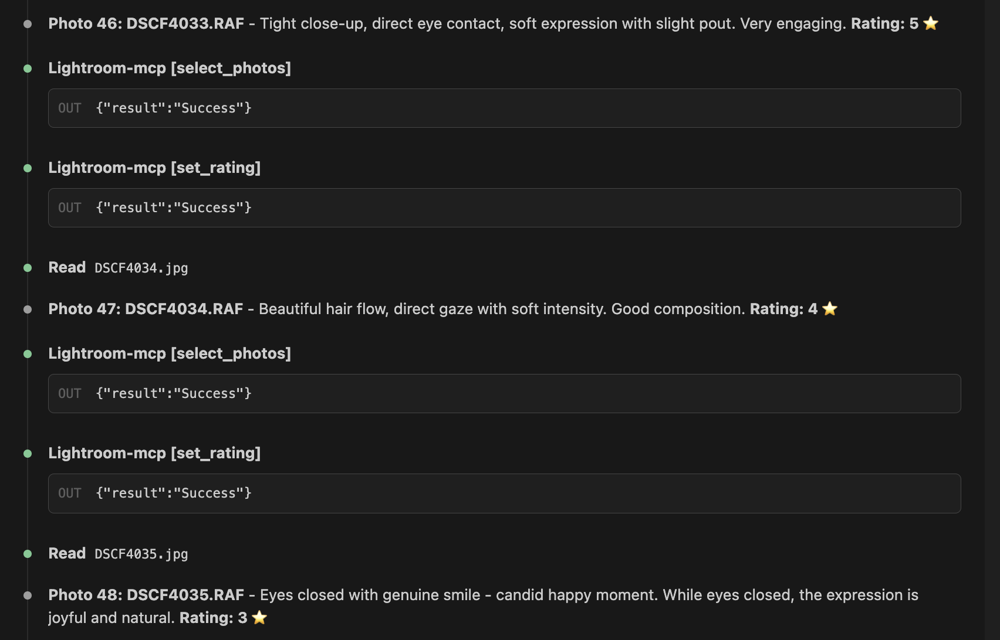

# AI-Powered Photo Culling with Claude and Lightroom MCP

So I built a thing that lets Claude rate my photos in Lightroom. This is based on [lightroom-mcp](https://github.com/synthet/lightroom-mcp) - an MCP server that bridges Claude and Lightroom Classic. Here's how it actually works and what I learned along the way.

## The Problem

I shoot a lot. Like, 800+ photos in a single session. Culling through all of them to find the keepers is tedious. What if I could have an AI assistant look at each photo, evaluate composition and pose, and assign star ratings automatically?

## The Architecture

The setup has three parts talking to each other:

```
┌─────────────────┐     MCP      ┌──────────────┐   WebSocket   ┌─────────────────────┐
│  Claude Code    │ ◄──────────► │ MCP Server   │ ◄───────────► │ Lightroom + Plugin  │
│  (VS Code)      │              │  (Python)    │               │      (Lua)          │
└─────────────────┘              └──────────────┘               └─────────────────────┘
```

1. **Claude Code** runs in VS Code and has access to MCP tools
2. **MCP Server** (Python) exposes Lightroom operations as tools Claude can call
3. **Lightroom Plugin** (Lua) listens for commands and executes them in Lightroom
4. **Broker** sits between the MCP server and plugin, handling the WebSocket communication


*The broker dashboard showing request logs alongside Lightroom with the photo being rated*

## The Workflow

Here's what happens when Claude rates a photo:

1. **Get the preview**: Claude calls `get_photo_preview()` which extracts an embedded JPEG from the RAW file using `rawpy`
2. **Analyze the image**: Claude looks at the preview and evaluates composition (rule of thirds, leading lines, framing) and pose/expression
3. **Set the rating**: Claude calls `set_rating(n)` where n is 1-5 stars
4. **Move to next**: Repeat for each photo in the selection


*Claude analyzing each photo and setting ratings with brief explanations*

## The Gotchas (aka What Actually Took Time)

### RAW Preview Extraction

The Lightroom SDK has `requestJpegThumbnail()` which should generate previews directly from Lightroom's cache. Tried it. The async callback pattern with `LrTasks.sleep()` polling blocked the WebSocket connection and caused timeouts.

The workaround: extract embedded JPEGs from RAW files directly using `rawpy` on the Python side. Most RAW files (RAF, CR2, NEF, etc.) have full-size JPEG previews embedded. This is actually faster since it doesn't require Lightroom to render anything.

```python
raw = rawpy.imread(file_path)
thumb = raw.extract_thumb()
if thumb.format == rawpy.ThumbFormat.JPEG:
    img = Image.open(io.BytesIO(thumb.data))
```

### Preview Size for AI Analysis

I used 800px max dimension, which resulted in **800x533** previews (maintaining the 3:2 aspect ratio). Each file was around 60-80KB - big enough to see composition and expressions, small enough to not waste tokens. The previews get saved to `/tmp/lr_previews/` as JPEGs, then Claude reads them with the `Read` tool which displays images inline.

## The Rating Criteria

I told Claude to focus only on:
- **Composition**: Rule of thirds, leading lines, balance, framing, negative space
- **Pose/Expression**: Natural poses, engaging expressions, eye contact, body language

And explicitly ignore exposure, white balance, color - those are fixable in post. A badly composed shot with perfect exposure is still a bad shot.

## Sample Output

```
Photo 46: DSCF4033.RAF
Rating: 5 ⭐
Reason: Tight close-up, direct eye contact, soft expression with slight pout. Very engaging.

Photo 47: DSCF4034.RAF
Rating: 4 ⭐
Reason: Beautiful hair flow, direct gaze with soft intensity. Good composition.

Photo 48: DSCF4035.RAF
Rating: 3 ⭐
Reason: Eyes closed with genuine smile - candid happy moment. While eyes closed, the expression is joyful.
```

## Performance

Rating 50 photos took about 10-15 minutes with detailed analysis. For 819 photos, you're looking at a few hours. The bottleneck is:
1. Reading each preview file (~0.5s)
2. Claude analyzing the image (~2-3s)
3. MCP round-trips for select + set_rating (~1s)

Could be parallelized but the sequential approach gives you a nice log of what's happening.

## The Elephant in the Room: AI Doesn't See Like Photographers

Here's the honest truth: the ratings aren't optimal. Claude applies rules - rule of thirds, check. Eyes open, check. Hands visible, check. But photography isn't a checklist.

The biggest struggle? **Awkward vs. artistic**.

A hand positioned in an unconventional way might be:
- An awkward pose that ruins the shot, or
- A deliberate artistic choice that makes it interesting

Claude tends to flag anything "unusual" as problematic. That hand draped across the face? "Hands slightly busy." The dreamy eyes-closed shot? "Less engaging." But sometimes those are exactly the shots you want.

The AI also lacks context. It doesn't know:
- Your personal style or the client's preferences
- That this is the 5th shot in a series and you're looking for variety
- That the "imperfect" expression actually captures genuine emotion
- What makes a shot feel *alive* vs. technically correct but boring

**What works well**: Catching obvious rejects - closed eyes in a portrait meant to have eye contact, severe motion blur, completely missed focus, terrible framing.

**What doesn't work well**: Distinguishing between a 4-star "good shot" and a 5-star "this is the one." That still requires human taste.

Think of it as a first pass that handles the obvious culls, not a replacement for your eye.

## What I'd Do Differently

1. **Batch the previews upfront**: Generate all previews first, then have Claude rate them. Avoids Lightroom connection issues mid-workflow.

2. **Add a "compare" mode**: Sometimes you want to pick the best from a series of similar shots. A side-by-side comparison tool would help.

## The Code

This project is built on [lightroom-mcp](https://github.com/synthet/lightroom-mcp). The MCP tools that make this work:

- `get_selection()` - Get currently selected photos with metadata
- `select_photos([ids])` - Select specific photos by their local IDs
- `get_photo_preview(width, height)` - Extract JPEG preview from RAW
- `set_rating(1-5)` - Apply star rating to selection

